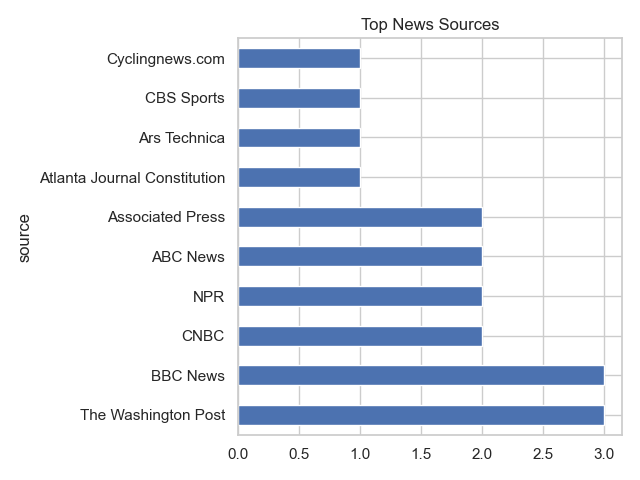

# 📰 News Trends API Analyzer

Welcome! This project fetches the latest business news headlines, analyzes trends, sentiment, and topics, and visualizes the results. It helps you quickly explore news data and gain insights into current trends, public sentiment, and topic clusters.

## 🚀 Features
- Fetches top business headlines from NewsAPI
- Visualizes top sources, publishing hours, and keyword clouds
- Performs sentiment analysis and keyword extraction
- Clusters headlines into topics using KMeans and TF-IDF
- Generates human-readable labels for each cluster using top TF-IDF keywords
- Prints a cluster summary table to the console for easy interpretation
- Visualizes the number of headlines per named cluster in a bar chart
- Visualizes the distribution of sentiment confidence scores
- Saves all results as plots and CSVs for further analysis

## 🤖 Sentiment Analysis Approach
The project uses a transformer-based model for sentiment analysis:
- Uses the `cardiffnlp/twitter-roberta-base-sentiment` model (via Hugging Face Transformers and torch) to predict sentiment for each headline.
- Headlines are processed in batches for efficiency.
- For each headline, the model outputs a sentiment label (Negative, Neutral, or Positive) and a confidence score.
- If a headline contains certain negative keywords (like "killed", "fire", "disaster", "attack"), it is always labeled as Negative for extra safety.
- Only headlines with a confidence score ≥ 0.7 are included in the sentiment output CSV and visualizations.
- The distribution of all sentiment confidence scores is visualized in a histogram plot.

📝 **Note:** This approach is much more accurate for news headlines than lexicon-based methods, but may still misclassify some headlines due to the complexity of news language. For best results, consider using a model fine-tuned specifically for news sentiment in future work.

## ⚙️ Setup
Make sure you have Python 3.8 or higher installed.

Install the required packages:
```bash
pip install -r requirements.txt
```

## ▶️ Usage
Run the project from the root directory:
```bash
python main.py
```

This will:
- Download the latest business news headlines
- Generate and save plots in the `output/` folder
- Save processed data and analysis results in the `data/` folder
- Cluster headlines into topics and generate topic visualizations
- Generate and save human-readable labels for each cluster in `data/clustered_headlines_labeled.csv`
- Print a summary table of clusters and example headlines to the console
- Create a bar chart of the number of headlines per named cluster in `output/named_topic_summary.png`
- Visualize the distribution of sentiment confidence scores in `output/sentiment_confidence_hist.png`
- Only headlines with sentiment confidence ≥ 0.7 are included in the sentiment output CSV and visualizations

## 📦 Output
- 📊 Plots:
  - `output/top_sources.png` — Top news sources
  - `output/publish_hours.png` — Publishing frequency by hour
  - `output/headline_wordcloud.png` — Word cloud of headline keywords
  - `output/sentiment_chart.png` — Sentiment distribution (confidence ≥ 0.7)
  - `output/sentiment_confidence_hist.png` — Histogram of sentiment confidence scores
  - `output/top_keywords.png` — Top keywords in headlines (confidence ≥ 0.7)
  - `output/topic_summary.png` — Bar chart of headline count per topic cluster
  - `output/cluster_wordclouds/cluster_X.png` — Word cloud for each topic cluster
  - `output/named_topic_summary.png` — Bar chart of headline count per named cluster
- 🗃️ Data:
  - `data/top_headlines.csv` — Cleaned news headlines
  - `data/top_keywords.csv` — Top keywords and their counts (confidence ≥ 0.7)
  - `data/headlines_with_sentiment.csv` — Headlines with sentiment labels and confidence scores (confidence ≥ 0.7)
  - `data/clustered_headlines.csv` — Headlines with assigned topic clusters
  - `data/clustered_headlines_labeled.csv` — Headlines with cluster numbers and human-readable topic labels

## 🖼️ Example Plots
Here are some example outputs generated by the project:




## 🛠️ Technologies Used
- Python 3.8+
- pandas
- matplotlib
- seaborn
- wordcloud
- requests
- scikit-learn
- nltk
- numpy
- torch
- transformers

## 🔍 How it Works
1. Fetch News: Downloads the latest business headlines from NewsAPI and processes them for analysis.
2. Visualize Trends: Creates plots for top sources, publishing hours, and a word cloud of keywords.
3. Analyze Sentiment: Uses a transformer-based model and custom rules to label each headline as positive, negative, or neutral, and saves confidence scores. Only headlines with confidence ≥ 0.7 are included in the output. The distribution of all confidence scores is visualized.
4. Extract Keywords: Finds the most common keywords in the headlines (excluding stopwords).
5. Cluster Topics: Uses TF-IDF and KMeans to group headlines into topics, and visualizes each cluster.
6. Label Clusters: For each cluster, finds the top TF-IDF keywords and generates a human-readable label, saving the result to `data/clustered_headlines_labeled.csv`.
7. Print Cluster Summary: Shows a summary table in the console with each cluster's label, size, and example headlines.
8. Visualize Named Clusters: Plots the number of headlines per named cluster and saves the chart to `output/named_topic_summary.png`.
9. Save Results: All plots and CSVs are saved in the appropriate folders for easy access.

## 📄 License
This project is licensed under the [MIT License](LICENSE)
